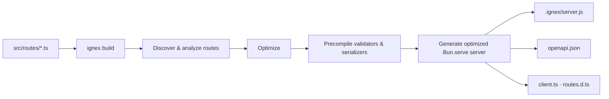

# ignex

> **Fast, type-safe HTTP APIs on Bun — where routes are just files.**

Write your endpoints as plain TypeScript files, run `ignex build`, and get a
natively-compiled `Bun.serve` server with generated types, an OpenAPI spec, and
a typed client. No router config, no decorators, no magic — the filename *is*
the route.

- 🚀 **Compiled, not interpreted** — routes are compiled ahead of time into an
  optimized native server (precompiled validators, serializers, zero-cost
  constant responses).
- 📁 **The filename is the route** — `hello.get.ts` → `GET /hello`. That's the
  whole mental model.
- 🧰 **Everything's built in** — validation, auth, sessions, jobs, SSE,
  WebSockets, i18n, templates, caching, rate limiting, CORS, security headers,
  and a debug dashboard.
- 🧬 **Type-safe end to end** — schemas type your `ctx`, your responses, your
  generated client, and your OpenAPI document.
- ⚡ **Rust-accelerated (optional)** — hot paths run through the native
  `castrum` addon with byte-compatible pure-TS fallbacks. No native build? No
  problem.

[Quick Start](#quick-start) · [Your First App](#your-first-app) ·
[Core Concepts](#core-concepts) · [Guides](#guides) ·
[CLI Reference](#cli-reference) · [Learn More](#learn-more)

---

## Quick Start

You only need [Bun ≥ 1.4](https://bun.sh) — nothing else is installed globally.

```sh
# 1. Scaffold a project
bun create ignex my-api

# 2. Install & start
cd my-api
bun install
bun run dev
```

Open **http://localhost:3000** — you're running an ignex API. The dev server
recompiles and restarts on every file change.

> **HTTPS by default.** ignex serves HTTPS in development, auto-generating a
> locally-trusted certificate (mkcert → openssl fallback). No tools installed?
> It falls back to HTTP/1 with a friendly warning — nothing breaks.

Want the batteries included? Pick features at scaffold time:

```sh
bun create ignex my-api --features auth,sessions,openapi,examples,tests
```

*Prefer a different runner? `bunx @ignex/cli@latest create my-api` does the
same thing.*

---

## Your First App

Let's build a small API together. Everything below is copy-paste.

### 1. Create the project

```sh
bun create ignex my-api
cd my-api
bun install
```

You get a tidy, conventional layout:

```
my-api/
├── src/
│   ├── routes/            ← your API lives here
│   ├── app.config.ts      ← plugins, lifecycle, server options
│   └── config/env.ts      ← validated environment variables
├── ignex.config.ts        ← compiler settings
├── test/                  ← a scaffolded integration test
└── package.json
```

### 2. Write your first route

Routes are files under `src/routes/`. **The path and method suffix in the
filename are the route** — there is nothing to register.

Create `src/routes/hello.get.ts`:

```ts
import { get } from "@ignex/core/http";

export default get((ctx) => ctx.text("Hello World!"));
```

Start the dev server and open **http://localhost:3000/hello**:

```sh
bun run dev
```

That's a complete route. `hello.get.ts` → `GET /hello`.

A **named export** works just as well — both styles compile to the same server:

```ts
import { get } from "@ignex/core/http";

export const httpGet = get((ctx) => ctx.text("Hello World!"));
```

### 3. Add a dynamic route

Want `GET /products/:id`? Create a folder and a file:

```ts
// src/routes/products/[id].get.ts → GET /products/:id
import { get } from "@ignex/core/http";

export default get((ctx) => ctx.json({ id: ctx.params.id }));
```

- `[id]` in the filename becomes a `:id` path parameter.
- `ctx.params.id` is typed as a string.

### 4. Read a request body

```ts
// src/routes/todos.post.ts → POST /todos
import { post } from "@ignex/core/http";

export default post(async (ctx) => {
  const body = await ctx.body.json<{ title: string }>();
  return ctx.json({ created: body.title }, { status: 201 });
});
```

`ctx.body` is **lazy** — the request body is only parsed when you read it.
`.json()`, `.formData()`, and `.text()` all work.

### 5. Validate input (and get types for free)

Pass a schema as the second argument. ignex validates input *and* types your
`ctx`:

```ts
import { get } from "@ignex/core/http";
import { Type } from "typebox";

export default get(
  (ctx) => ctx.json({ id: ctx.params.id }),
  {
    params: Type.Object({ id: Type.String() }),
  },
);
```

Invalid input returns a structured `422`. At build time the same schema becomes
a precompiled standalone validator and flows into your OpenAPI document.

### 6. What you get for free

Run `bun run build`, then look in `.ignex/`:

| Artifact       | What it is                                          |
| -------------- | --------------------------------------------------- |
| `server.js`    | The compiled server — run it with `bun run start`   |
| `openapi.json` | An OpenAPI 3.1 spec derived from your real schemas  |
| `client.ts`    | A typed HTTP client for your frontend               |
| `routes.d.ts`  | Typed route map consumed by that client             |
| `manifest.json`| Per-route metadata for tooling                      |

Add the `openapi()` plugin and `GET /openapi.json` serves the spec while
`GET /openapi` serves an interactive docs UI — zero extra work.

---

## Core Concepts

Only three ideas to learn. Then you know ignex.

### 1. Routes are files

The filename encodes the path **and** the HTTP method:

| File                                 | Route                  |
| ------------------------------------ | ---------------------- |
| `src/routes/index.get.ts`            | `GET /`                |
| `src/routes/hello.get.ts`            | `GET /hello`           |
| `src/routes/hello.post.ts`           | `POST /hello`          |
| `src/routes/products/[id].get.ts`    | `GET /products/:id`    |
| `src/routes/files/[...path].get.ts`  | `GET /files/*path`     |
| `src/routes/api/users/index.post.ts` | `POST /api/users`      |

Method suffixes: `.get.ts`, `.post.ts`, `.put.ts`, `.patch.ts`, `.del.ts`
(DELETE), `.head.ts`, `.options.ts`, and `.all.ts` for any method. Missing
`HEAD` / `OPTIONS` responses are auto-generated for you.

### 2. Handlers receive a typed `ctx`

Every handler gets a `ctx` with everything you need:

```ts
ctx.params   // path parameters         ctx.query   // query string
ctx.body     // lazy body (json / form / multipart / text)
ctx.headers  // request headers         ctx.cookie  // cookies
ctx.json()   // respond with JSON       ctx.text()  // respond with text
ctx.html()   // respond with HTML       ctx.set     // set headers / status / cookies
```

Returning a plain value is fine too — ignex serializes it (objects → JSON), and
`ctx.json()` / `ctx.text()` / `ctx.html()` responses are pre-encoded and
optimized at build time.

### 3. Build once, deploy anywhere

`ignex build` compiles your routes into one optimized server. No runtime router,
no middleware-chain overhead — just Bun's native routing plus precompiled
validators and serializers.



Prefer no build step? Use the interpreted
[`createApp` + `createRouter`](#the-interpreted-path-no-build-step) API — same
DX, no compilation.

---

## Guides

### Responses

`ctx.*` helpers are the recommended way to respond — they're pre-encoded at
build time (one `TextEncoder` pass, exact `content-length`):

```ts
export default get((ctx) => ctx.text("Hello World"));     // text/plain
export default get((ctx) => ctx.json({ ok: true }));       // application/json
export default get((ctx) => ctx.html("<h1>Hello</h1>"));   // text/html
```

Set a status code (default is `200`):

```ts
export default get((ctx) => ctx.json({ error: "not found" }, { status: 404 }));
```

Return a plain value and ignex serializes it for you (objects → JSON):

```ts
export default get(() => ({ status: "ok", time: Date.now() }));
```

Return `{ status, body }` for multi-status responses typed per status:

```ts
export default post((ctx) => ({ status: 201, body: { created: true } }));
```

Return a raw `Response` for streams, files, SSE, redirects, and proxies — it
passes through untouched.

### Params, query & body

```ts
// src/routes/products/[id].get.ts
export default get((ctx) => ctx.json({ id: ctx.params.id }));
```

```ts
// src/routes/search.get.ts → GET /search?q=shoes&limit=20
export default get((ctx) => ctx.json({ q: ctx.query.q, limit: ctx.query.limit }));
```

```ts
// src/routes/users.post.ts
export default post(async (ctx) => {
  const body = await ctx.body.json<{ name: string }>();
  const form = await ctx.body.formData();  // multipart/form-data
  const text = await ctx.body.text();      // raw text
  return ctx.json({ name: body.name });
});
```

### Validation & OpenAPI

Schemas come from **TypeBox** (or any Standard Schema — zod, valibot, …). They
type your `ctx` at compile time and validate at runtime:

```ts
import { post } from "@ignex/core/http";
import { Type } from "typebox";

export default post(
  async (ctx) => ctx.json({ user: ctx.body }),
  {
    body: Type.Object({
      email: Type.String({ format: "email" }),
      age: Type.Optional(Type.Integer({ minimum: 0 })),
    }),
    query: Type.Object({ ref: Type.Optional(Type.String()) }),
  },
);
```

Available schema parts: `body`, `query`, `params`, `headers`, `cookie`, and
`response` (a single schema or per-status `Record<number, schema>`).

**Serve your docs** with the `openapi()` plugin in `src/app.config.ts`:

```ts
import { openapi } from "@ignex/core";

export const plugins = [
  openapi({ documentation: { title: "my-api", version: "0.1.0" } }),
];
```

- `GET /openapi.json` — the OpenAPI 3.1 document.
- `GET /openapi` — an interactive docs UI (Scalar, or Swagger-UI via
  `provider: "swagger-ui"`).
- Per-route metadata (`summary`, `tags`, `hide`, …) via
  `export const config = { detail: { ... } }` in the route file.

### Errors

Throw a structured error from any handler and ignex turns it into the right
response — no try/catch needed:

```ts
import { ForbiddenError, NotFoundError } from "@ignex/core";

export default get((ctx) => {
  const user = db.find(ctx.params.id);
  if (!user) throw new NotFoundError("User not found");   // → 404
  if (!user.visible) throw new ForbiddenError("Nope");     // → 403
  return ctx.json({ user });
});
```

Error types: `BadRequestError` (400), `UnauthorizedError` (401),
`ForbiddenError` (403), `NotFoundError` (404), `ConflictError` (409),
`TooManyRequestsError` (429), `ValidationError` (422, field-scoped), and the
base `HTTPError(status, message, code?, details?)`.

### Middleware & lifecycle

Global logic (logging, headers, auth checks) lives in lifecycle hooks, wired in
`src/app.config.ts`:

```ts
export const lifecycle = {
  beforeHandle: [logRequests(), markResponse()],
};
```

A hook returns `continueHook(ctx)` to proceed or `haltHook(response)` to
short-circuit:

```ts
import { continueHook, type HookFn } from "@ignex/core";

export const markResponse = (): HookFn => {
  return (ctx) => {
    ctx.set.headers["x-powered-by"] = "ignex"; // applied to the final response
    return continueHook(ctx);
  };
};
```

Stages (in order): `start → request → parse → transform` run before the
handler; `afterHandle → mapResponse` run after.

**Per-route** hooks and guards go on the route itself:

```ts
import { get } from "@ignex/core/http";
import { authorize } from "@ignex/core";

export default get(
  (ctx) => ctx.json({ me: ctx.user }),
  { before: [authorize({ permissions: ["profile:read"] })] },
);
```

Or reference a named hook by string:

```ts
export const config = { hooks: ["require-auth"] };
```

RBAC primitives are ready to compose: `requireAuthenticated`, `hasRole`,
`can`, `canAll`, `composeGuards`.

### Plugins

Plugins are the framework's building blocks. Register them in the `plugins`
array of `src/app.config.ts`:

```ts
import { compression, cors, logger, rateLimit, security, session } from "@ignex/core";

export const plugins = [
  cors(),                        // CORS with sensible defaults
  security(),                    // security headers
  compression(),                 // gzip / brotli
  rateLimit({ max: 100, windowMs: 60_000 }),
  logger(),                      // request logging
  session({ secret: process.env.SESSION_SECRET ?? "dev-secret", createIfMissing: true }),
];

export const server = { port: Number(process.env.PORT ?? 3000) };
```

Plugins available: `cors()`, `security()`, `compression()`, `rateLimit()`,
`logger()`, `csrf()`, `session()`, `openapi()`, `debugbar()`,
`nativePreflight()`, `novaPlugin()` (typed realtime), and more. Write your own
as small `IgnexPlugin` factories — see the [cookbook](docs/cookbook.md).

### Configuration & environment

Environment variables are declared as a typed schema in `src/config/env.ts` —
no sprinkling `process.env` everywhere:

```ts
import { defineEnv, Type } from "@ignex/core/env";

export const envSchema = Type.Object({
  NODE_ENV: Type.String({ default: "development" }),
  PORT: Type.Integer({ default: 3000, minimum: 1, maximum: 65535 }),
  DEBUG: Type.Boolean({ default: false }),
  // No default → optional. Mark secrets so values never leak into errors.
  SESSION_SECRET: Type.Optional(Type.String({ metadata: { secret: true } })),
  // Required — boot fails when unset.
  DATABASE_URL: Type.String(),
});

export const env = defineEnv(envSchema);
```

`defineEnv` loads `.env` / `.env.local` (existing env wins), coerces strings
(`"8080"` → number, `"true"` → boolean), validates, and throws a structured
`EnvError` on missing required values. The scaffold generates `.env.example`
from the schema so the two never drift. `ignex doctor` reports env issues.

### Authentication & security

Scaffold a complete auth flow and it just works:

```sh
bun create ignex my-api --features auth
```

You get register / login / me / refresh routes, password hashing
(argon2id native / scrypt fallback), Ed25519 JWT access tokens, and a
`require-auth` hook:

```ts
// src/routes/me.get.ts
import { get } from "@ignex/core/http";
import { getUser } from "@ignex/core";

export const config = { hooks: ["require-auth"] };

export default get((ctx) => ctx.json({ user: getUser(ctx) }));
```

Security primitives included: JWT (HS256 + Ed25519), Basic/Bearer auth, signed
cookies, CSRF guard, AEAD encryption, HMAC, and password hashing.

### Sessions

```ts
// src/app.config.ts
session({ secret: process.env.SESSION_SECRET ?? "dev-secret", createIfMissing: true });
```

```ts
// src/routes/visits.get.ts
import { getSession } from "@ignex/core";

export default get(async (ctx) => {
  const session = getSession(ctx); // lazy: no session work until you read it
  if (!session) return ctx.json({ visits: null });

  const visits = ((session.data.visits as number | undefined) ?? 0) + 1;
  session.data.visits = visits;
  await session.save();

  return ctx.json({ id: session.id, visits, expiresAt: session.expiresAt });
});
```

Signed-cookie sessions by default; store-backed sessions (memory, SQLite,
file, Redis) for bigger state.

### Background jobs

In-process queue with concurrency, retries, and timeouts:

```ts
import { createJobQueue, withRetry, withTimeout } from "@ignex/core";

const queue = createJobQueue({ concurrency: 4 });

export default post((ctx) => {
  queue.enqueue(
    "send-email",
    withTimeout(5000)(
      withRetry(3)(async () => {
        await sendEmail(ctx.body);
      }),
    ),
  );
  return ctx.json({ enqueued: true });
});
```

Need durability across restarts? `createDurableJobQueue` with a file / SQLite /
Redis store gives you claim/lease semantics, crash recovery, recurring jobs,
and retry backoff.

### Realtime: SSE & WebSockets

**Server-Sent Events** — a route returns a stream:

```ts
import { sse } from "@ignex/core";

export default get(() =>
  sse(async function* () {
    yield { event: "ping", data: Date.now().toString() };
    yield { event: "update", data: "hi" };
  }),
);
```

**WebSockets:**

```ts
// src/ws.ts — wired from app.config.ts
import { createWSHandler } from "@ignex/core";

export const wsHandler = createWSHandler({
  open(ws) {
    ws.send("Welcome to ignex");
  },
  message(ws, message) {
    ws.send(String(message));
  },
});
```

For typed pub/sub over WebSockets (rooms, per-user delivery, cluster sync via
NATS), use `novaPlugin()` — see the [cookbook](docs/cookbook.md).

### i18n & templates

```ts
import { createI18n } from "@ignex/core";

const i18n = createI18n(
  { en: { greeting: "Hello {name}" }, es: { greeting: "Hola {name}" } },
  { fallbackLocale: "en" },
);

export default get((ctx) => {
  const locale = i18n.locale(ctx); // Accept-Language negotiation
  return ctx.json({ locale, message: i18n.t("greeting", { name: "world" }, locale) });
});
```

JSON catalogs load from `locales/*.json` via `createI18nFromDir`; `withI18n`
exposes `ctx.t`.

Jinja-compatible templates (native minijinja, JS fallback):

```ts
import { createTemplateDir, withLayout } from "@ignex/core";

export default get(async (ctx) => {
  const registry = await createTemplateDir("src/views");
  const page = withLayout((content, data) =>
    registry.render("layout", { ...data, content }),
  )((data) => registry.render("home", data));

  return ctx.html(page({ title: "My app", name: "world" }));
});
```

### Caching

```ts
import { withBrowserCache } from "@ignex/core";

export default get((ctx) => withBrowserCache(ctx.json({ cached: true }), { maxAge: 60 }));
```

Plus lower-level `cacheControl`, ETag / conditional requests, and an
`HttpResponseCache` with stale-while-revalidate.

### Static files & uploads

```ts
import { sendFile } from "@ignex/core";

// GET /files/:name — range requests + traversal guard built in
export default get((ctx) => sendFile(ctx, `public/${ctx.params.name}`));
```

Uploads: `saveUpload` / `serveUpload` handle multipart files with type allow
lists and size caps.

### Proxying

```ts
import { proxyRequest } from "@ignex/core";

export default get(() => proxyRequest("https://api.example.com"));
```

### Testing

Scaffolded projects ship vitest. Compile the app in your test, boot the
generated server, and assert against it — or unit-test your modules directly:

```sh
bun run test
```

### HTTPS, building & deploying

**Build for production:**

```sh
bun run build    # AOT-compile → .ignex/server.js + typed artifacts
bun run start    # run the compiled server
```

**Standalone binary** — embeds the Bun runtime (minify + bytecode), so no Bun
install is needed on the server:

```sh
ignex build --compile --binary-outfile my-server
./my-server
```

**HTTPS** — on by default. Dev auto-generates a local cert (mkcert);
production expects `server.tls: { certFile, keyFile }` or a TLS-terminating
proxy (Caddy / nginx / Cloudflare). Opt into HTTP/2 with `server.h2: true`.

Deployment files (Dockerfile, compose, Caddy, CI) are one command away:

```sh
ignex ops dockerfile
ignex ops compose
ignex ops caddy
ignex ops ci
```

See [docs/deployment.md](docs/deployment.md) for multi-instance production.

### The interpreted path (no build step)

Prefer runtime registration? `createApp` + `createRouter` gives you the same
native routing, lifecycle, and reply path without compiling:

```ts
import { cors, createApp, createRouter } from "@ignex/core";

const app = createApp({
  plugins: [cors()],
  router: createRouter()
    .get("/health", (ctx) => ctx.json({ ok: true }))
    .get("/api/users/:id", (ctx) => ctx.json({ id: ctx.params.id }))
    .post("/users", (ctx) => ctx.json({ created: true }), { body: userSchema })
    .all("/legacy/*", legacyFallback),
});
```

See [docs/router.md](docs/router.md) for the full lifecycle.

### The debug dashboard

Register `debugbar()` (dev only) and open **`/__debugbar`** — a Laravel-style
developer dashboard: per-request **waterfall** with DB/cache/HTTP timing,
error capture with **one-click request replay**, a CPU/memory/event-loop
**system profile**, the published SDK list, and more. It's eliminated from
production builds.

```ts
// src/app.config.ts — only active when DEBUG=true
...(env.DEBUG ? [debugbar({ serviceName: "my-api" })] : []),
```

## CLI Reference

| Command | What it does |
| --- | --- |
| `ignex create <name>` | Scaffold a new app (interactive wizard + feature flags) |
| `ignex route <path>` | Scaffold a route + its business-logic module |
| `ignex hook <name>` | Scaffold a lifecycle hook (or per-route with `--named`) |
| `ignex event <kind> <name>` | Scaffold event flows (sse / webhook / bus) |
| `ignex model <Name>` | Scaffold a schema-first model |
| `ignex resource <Name>` | Scaffold a model + CRUD routes |
| `ignex hotroute <Name>` | Scaffold a model + hot-cached CRUD |
| `ignex migrate <action>` | Run DB migrations (up / down / status / create) |
| `ignex seed` | Run (or scaffold) the DB seed script |
| `ignex dev [root]` | Compile + run the dev server (watch) |
| `ignex build [root]` | AOT-compile an app with diagnostics |
| `ignex doctor [root]` | Check project health (runtime, native, config, build) |
| `ignex ops <target>` | Generate deployment files (dockerfile / compose / caddy / ci) |
| `ignex sdk` | Generate + distribute the app SDK (typed client) |
| `ignex info [root]` | Dump runtime / native / config as JSON |
| `ignex mcp` | Run the Model Context Protocol server (stdio) |
| `ignex completions <shell>` | Print tab-completion script |

`ignex route --schema` adds TypeBox validation, `--named` switches to named
exports, and `--no-module` keeps the route single-file. The scaffold's npm
scripts wrap the common ones: `bun run dev`, `bun run build`, `bun run start`,
`bun run route`, `bun run test`, `bun run typecheck`.

## Native acceleration (`@ignex/native`)

The Rust NAPI addon (**castrum**) accelerates proven hot paths — hashing, crypto
(JWT, cookie signing, CSRF, HMAC, AEAD, argon2), HTTP parsing (query, cookie,
multipart, media types, ETags), SSE/WebSocket framing, compression, JSON
validation, and template rendering.

- Every function falls back to a **byte-compatible pure-TS implementation** —
  native is pure acceleration, never a requirement.
- Check status with `isNativeAvailable()`; force the fallback with
  `IGNEX_NATIVE=off` (a supported parity mode).
- `ignex dev` / `ignex build` print a `Native:` line so you always know which
  path is active.

## FAQ

**Do I need the native addon?** No. Everything works on pure TypeScript; native
only makes hot paths faster.

**Which ORM should I use?** ignex is ORM-agnostic. SQL: `ignex resource --db sql`
wraps [Drizzle](https://orm.drizzle.team) with ignex-shaped DX. Mongo:
`@ignex/ninox` is a schema-first toolkit.

**Can I use ignex without a build step?** Yes — see
[the interpreted path](#the-interpreted-path-no-build-step).

**Does it support HTTP/2?** Yes, with TLS (`server.h2: true`). For HTTP/3 put
Caddy in front.

**How do I get a typed client for my frontend?** Every build emits `client.ts`;
`ignex sdk` packages a standalone, versioned SDK you can publish for frontend
teams.

## Learn More

- [docs/getting-started.md](docs/getting-started.md) — the full walkthrough.
- [docs/cookbook.md](docs/cookbook.md) — copy-paste recipes (sessions, jobs,
  i18n, SSE, WebSockets, templates, caching, rate limiting, proxies, …).
- [docs/architecture.md](docs/architecture.md) — how the compiler + packages fit together.
- [docs/router.md](docs/router.md) — the interpreted `createRouter` path.
- [docs/deployment.md](docs/deployment.md) — multi-instance production.
- [docs/sdk.md](docs/sdk.md) — generating + distributing the app SDK.
- [docs/debugbar.md](docs/debugbar.md) — the developer dashboard.
- [docs/drivers.md](docs/drivers.md) — the store driver layer (memory/sqlite/file/redis).
- [docs/compatibility.md](docs/compatibility.md) — contracts with `@ignex/ninox`, `@ignex/nova`, `castrum`.
- [docs/adding-a-feature.md](docs/adding-a-feature.md) — plugins, hooks, compiler passes.
- [docs/release-process.md](docs/release-process.md) — cache versions, tagging, publishing.
- [Example app](packages/app/README.md) — the reference app exercising everything.

---

## Project status & roadmap

**Status:** functional and tested end-to-end — the AOT compiler, CLI
(`create`/`dev`/`build`/`doctor`/`route`/`resource`/`ops`/`sdk`/`mcp`), runtime
primitives, security suite, templates, i18n, durable jobs, native acceleration,
MCP server, and the debug dashboard.

**Roadmap:** publishing `@ignex/native` + `castrum` binaries for all major
platforms → OAuth2 providers (authorization-code, PKCE, token refresh) →
deeper Standard-Schema vendor coverage → i18n catalog hot-reload.

**Current limitations:**

- Native acceleration requires the `castrum` addon (pure-TS fallbacks always work).
- Password hashes are KDF-specific (argon2id native / `$scrypt$` fallback).
- The pure-TS template fallback covers the common Jinja subset; full Jinja needs native minijinja.
- The SQLite job store requires `bun:sqlite`; the file-backed store works everywhere.

---

## Contributing & development

This repository is the **ignex monorepo**. The workspace packages:

- `@ignex/compiler` — the AOT compiler pipeline
- `@ignex/core` — runtime primitives and HTTP helpers
- `@ignex/cli` — the developer CLI
- `@ignex/shared` — FP toolkit + the compiler↔runtime contract
- `@ignex/native` — Rust-accelerated primitives with pure-TS fallbacks
- `@ignex/mcp` — the Model Context Protocol server
- `@ignex/test-utils` — shared test helpers
- `packages/app` — the reference example app

Common commands:

```sh
bun install
bun run dev             # compile + watch the example app
bun run verify:quick    # typecheck + lint + jsdoc (fast gate)
bun run verify          # typecheck + lint + tests (CI gate)
bun run test:parallel   # all package tests, in parallel
bun run build           # AOT-compile the example app
bun run smoke           # boot the compiled server + assert every route
```

Start with [CONTRIBUTING.md](CONTRIBUTING.md) and [AGENTS.md](AGENTS.md).