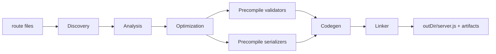

# @ignus/compiler

Ahead-of-time compiler for Ignus: discovers file-system routes, analyzes them with a
Svelte-style phased pipeline, and emits a clean, optimized Bun server with generated
types, OpenAPI artifacts, precompiled validators/serializers, and structured diagnostics.

## How it works



Every phase receives a `CompilerContext` carrying a `Logger` and a
`DiagnosticCollector`. Recoverable problems (unreadable files, parse failures,
validator/serializer fallbacks, dead routes, deprecations) are reported as
structured diagnostics with stable codes, file locations, and code frames —
never silently swallowed.

| Phase | Responsibility |
| --- | --- |
| **Discovery** | Recursively scan `routesDir`, parse each module to an AST (oxc-parser → Bun fallbacks), extract imports/exports/symbols/handlers. |
| **Analysis** | Lower `RouteIR`s from filenames (`[param]`, `[...rest]`, method suffixes), detect constant responses, dead/ambiguous routes and conflicts, resolve hooks and `app.config`. |
| **Optimization** | Mark inline-eligible handlers, deduplicate identical constant responses (per method), compute truthful metrics. |
| **Precompile** | Ajv standalone validators (`.cjs`) and `fast-json-stringify` serializers (`.mjs`) per route/schema part. |
| **Codegen** | Emit the server entry through an indentation-aware `Emitter` with dependency-aware pruning of generated runtime helpers (dead-code elimination). |
| **Linker** | Write the entry raw, or `Bun.build` it when `minify`/`sourceMap` is requested. |
| **Artifacts** | `routes.d.ts`, `client.d.ts`, `client.ts`, `openapi.json`, `manifest.json`. |

## Public API

```ts
import { buildAsync, type CompileResult } from "@ignus/compiler";

const result: CompileResult = await buildAsync({
  routesDir: "src/routes",
  outDir: ".ignus",
  outFile: "server.js",
});
```

`CompileResult`:

```ts
interface CompileResult {
  code: string;            // generated server entry source
  outFile: string;         // absolute path of the written entry
  diagnostics: Diagnostic[]; // all diagnostics (info + warning + error)
  warnings: Diagnostic[];  // recoverable problems
  errors: Diagnostic[];    // fatal problems
  metadata: CompilationMeta;
  cached?: boolean;        // true when the incremental cache was hit
}
```

### Entry points

- `buildAsync(options?)` / `new IgnusCompiler(options).compileAsync()` — **canonical**.
  Enables validator/serializer precompilation, minification, source maps, and the
  incremental cache.
- `build(options?)` / `new IgnusCompiler(options).compile()` — **deprecated** sync
  path. It cannot precompile validators/serializers, minify, or emit source maps;
  it emits an informational `IGN_SYNC_LIMITED` diagnostic.
- `mergeOptions(partial)` — fill defaults (`defu`).

## Compiler options

| Option | Default | Notes |
| --- | --- | --- |
| `routesDir` | `./src/routes` | Route source directory. |
| `outDir` / `outFile` | `./.ignus` / `server.js` | Output location. |
| `appConfig` | `./src/app.config.ts` | Optional runtime config (`plugins`, `lifecycle`, `server`). |
| `hooksDir` | — | Directory containing hook modules referenced by route `config`. |
| `minify` / `sourceMap` | `false` | Passed to `Bun.build` in the linker. |
| `optimizationLevel` | `3` | Reserved preset knob (0–3). |
| `inlineThreshold` / `maxInlineBytes` | `50` / `2048` | Gates for handler inlining. |
| `enableHandlerDeduplication` | `true` | Deduplicate identical constant responses (per method). |
| `treeshakeRuntime` | `true` | Prune unused generated runtime helpers. |
| `hoistConstants` | `true` | Hoist constant responses to `Object.freeze` bodies. |
| `specializeContext` | `true` | Emit route-specialized context objects instead of the full context. |
| `routeCache` | `true` | Runtime HTTP response caching for `config.cache` routes. |
| `incremental` | `true` | Skip the full build when inputs are unchanged (content-hash cache). |
| `precompileValidators` / `precompileSerializers` | `true` | Emit Ajv/fast-json-stringify artifacts. |
| `generateTypes` / `generateOpenAPI` / `generateClient` | `true` | Emit `routes.d.ts`, `openapi.json`, `client.d.ts`. |
| `strictRouteConflicts` | `false` | Throw on duplicate routes. |
| `maxJsonBytes` / `maxTextBytes` / `maxFormBytes` / `maxFileBytes` | — | Body size limits. |
| `target` | `bun` | Runtime target for generated output. |
| `maxRequestBodySize` | `128 MB` | `Bun.serve` max request body size. |
| `validateCookies` | `true` | Validate cookies at runtime. |
| `enableAccessLog` / `enableTraceHeaders` | `false` | Observability: structured access log / trace headers. |
| `verbose` | `false` | Verbose compiler logging. |
| `serviceName`, `exposeErrorDetails`, `reusePort`, … | — | Server/feature flags. |

### Deprecated / removed options

Removed options are accepted with an `IGN_OPTION_DEPRECATED` diagnostic and
ignored, so existing configs do not hard-fail:

| Option | Replaced by |
| --- | --- |
| `router` | Always emits Bun's native router. |
| `cluster` | Configure at the runtime/Bun level. |
| `inlineHooks` | Hooks are always invoked at runtime. |

## Diagnostics

All diagnostics carry a stable `code`, a `severity` (`error` | `warning` | `info`),
a message, and optional `file` + `position` + rendered `frame`.

| Code | Severity | Meaning |
| --- | --- | --- |
| `IGN_PARSE_ERROR` | warning | A module failed to parse; the route is skipped. |
| `IGN_IO_READ_FAILED` / `IGN_IO_SCAN_FAILED` | warning | Filesystem read/scan failure during discovery. |
| `IGN_MODULE_LOAD_FAILED` | warning | A module could not be imported for precompilation. |
| `IGN_ROUTE_CONFLICT` / `IGN_AMBIGUOUS_ROUTE` | warning | Duplicate/ambiguous routes. |
| `IGN_ROUTE_DEAD` | warning | A dead or duplicate route was eliminated. |
| `IGN_VALIDATOR_COMPILE_FAILED` | warning | Ajv standalone compile failed; runtime validation is used. |
| `IGN_SERIALIZER_FALLBACK` | warning | Response serializer fell back to `JSON.stringify`. |
| `IGN_CONFIG_EVAL_FAILED` | warning | A route `config` export is not statically evaluable. |
| `IGN_OPTION_DEPRECATED` | warning | A removed option was passed and ignored. |
| `IGN_OPTION_UNKNOWN` | warning | An unknown option was passed, ignored, and stripped (typos never hard-fail a build). |
| `IGN_STANDARD_SCHEMA_RUNTIME` | warning | A Standard-Schema part could not be converted to JSON Schema; validated/serialized at runtime. |
| `IGN_SYNC_LIMITED` | info | The deprecated sync path cannot honor async-only features. |
| `IGN_LINK_FAILED` / `IGN_ARTIFACT_WRITE_FAILED` | error | Fatal problems that abort the build. |
| `IGN_BUILD_CACHE_INVALID` | warning | The incremental cache could not be read/written. |

## Incremental caching

When `incremental` is enabled, the compiler fingerprints the effective options,
compiler version, and the content + mtime of every route/hook/app-config file. If
nothing changed and the previous output still exists, the whole pipeline is skipped
and the result is returned with `cached: true`. The fingerprint lives in
`outDir/.ignus-cache.json`.

On cache hits the compiler also verifies the companion artifacts the generated
server depends on (`validators/*`, `serializers/*`, `openapi.json`, `client.ts`,
`client.d.ts`, `routes.d.ts`, `manifest.json`); if any are missing, the build runs
again instead of serving broken output.

### Persistent module cache

Every module's `ParseResult` (imports/exports/symbols/handler/config + AST) is
persisted to `outDir/.ignus-modules.json`, keyed by content hash. Cache-hit
artifact regeneration and full rebuilds rehydrate unchanged modules from disk
instead of re-parsing them — an edit to one route re-parses only that route.
Bump `MODULES_CACHE_VERSION` (in `src/frontend/persist.ts`) when the persisted
shape changes.

## Generated output

With default options the server entry is readable and deterministic:

- A single `@ignus/core` import (symbols pruned to what is used).
- Frozen header constants (`EMPTY_PARAMS`, `BODY_LIMITS`, `EXPOSE_ERRORS`).
- Only the runtime helpers actually referenced by a route (`// ==== Generated runtime helpers ====`).
- Inlined handlers for fully self-contained route modules (no imports, no other
  top-level symbols, small body).
- A `Bun.serve({ routes })` table with automatic `HEAD`/`OPTIONS` and 404/405 fallbacks.

Enable `minify: true` to bundle the entry with `Bun.build` for production.

## Optimization presets

`optimizationLevel` (0–3) now maps to documented knob groups (see `optimizationPresets` in `src/types.ts`):

- `0` — raw output: no inlining/dedup, no precompilation, no hoisting/treeshaking, no cache.
- `1` — inlining + handler deduplication.
- `2` — + constant hoisting, context specialization, runtime treeshaking, route caching.
- `3` — + validator/serializer precompilation and incremental caching (default).

Explicit option values always override the preset.

## New in this version

- **Persistent module parse cache** — `SourceFile` parse results are persisted
  across builds (`.ignus-modules.json`, content-hash keyed); cache-hit paths
  rehydrate instead of re-parsing.
- **Standard-Schema build-time codegen** — convertible parts are turned into
  plain JSON Schema (`toJSONSchema`/`toJsonSchema`, zod, valibot) and precompiled
  into Ajv standalone validators + `fast-json-stringify` serializers; other
  vendors fall back to runtime with `IGN_STANDARD_SCHEMA_RUNTIME`.
- **Cache integrity** — companion artifacts are verified on cache hits.
- **Bounded module cache** — the precompilation `moduleCache` is capped (FIFO).
- **`$id`-preserving validator compilation** — each route gets its own Ajv
  instance, so `$ref` resolution works without stripping `$id`.
- **Hook read-failure detection** — an unreadable hook surfaces
  `IGN_IO_READ_FAILED` instead of being treated as an empty hook.
- **Parse memoization** — modules are parsed once per content (was up to 5×).
- **Native hashing** — cache fingerprints / content keys use `@ignus/native` FNV-1a 64.
- **Real optimization metadata** — `CompileResult.metadata` reflects the build and is persisted across cache hits.
- **Hook analysis** — referenced hooks are validated (`IGN_HOOK_MISSING` when missing).
- **OpenAPI schemas** — `openapi.json` now emits real request/response schemas from route schemas.
- **Generated client** — `client.ts` (a real `createApiClient` implementation) alongside `client.d.ts`.
- **Route hotness & call-graph metadata** — intra-module symbol call graph and route hotness scoring (in `manifest.json`).

## Development

```sh
bun run --cwd packages/compiler test   # vitest suite
bun run --cwd packages/compiler typecheck
```
